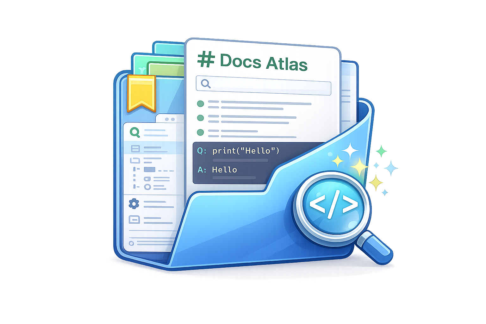
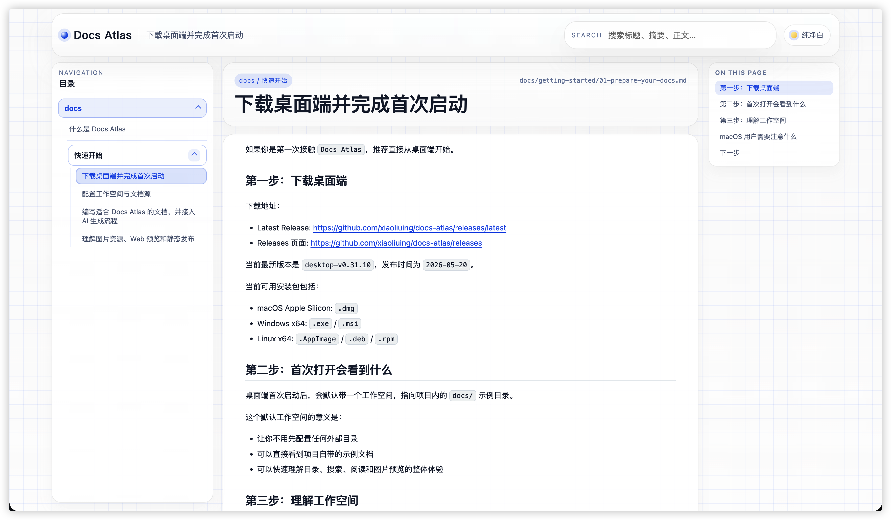
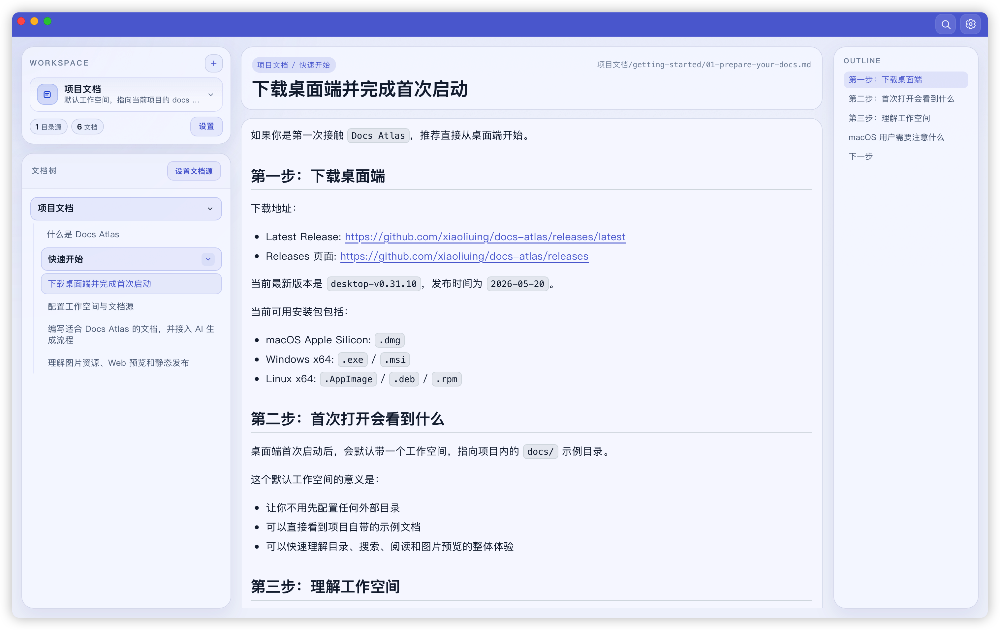

# Docs Atlas

[](./LICENSE)

<div align="center">
  
</div>


Docs Atlas 是一个面向本地 Markdown 文档的聚合阅读器，当前以桌面端为主，Web 端作为预览、分享和静态发布入口。

它解决的问题很直接：设计文档、教程文档、接入说明和 AI 生成文档，往往散落在不同项目和不同目录里，阅读入口不统一，搜索范围也被割裂。Docs Atlas 用统一的目录、搜索和阅读体验，把这些分散内容重新组织起来。

## 项目定位

Docs Atlas 不是在线协作平台，也不是后台 CMS。

它更像一个开发者本地知识库阅读器，重点能力是：

- 聚合多个本地文档目录
- 用统一目录结构组织不同项目文档
- 在一个入口里完成浏览、搜索、跳转和阅读
- 为 AI 生成文档提供稳定的落地和查看方式

当前阶段，项目以 `Desktop` 为主产品形态，`Web` 为补充能力。

## 下载与体验

在线演示：

- Web Demo: https://xiaoliuing.github.io/docs-atlas/



桌面端下载：

- Latest Release: https://github.com/xiaoliuing/docs-atlas/releases/latest
- Releases 页面: https://github.com/xiaoliuing/docs-atlas/releases



当前可下载资产包括：

- macOS Apple Silicon: `.dmg`
- Windows x64: `.exe` / `.msi`
- Linux x64: `.AppImage` / `.deb` / `.rpm`

注意：

- 当前 macOS 包未接入 Apple 签名与 notarization
- 在部分 macOS 设备上，首次打开可能需要用户在系统安全设置中手动放行

## Desktop 端能做什么

桌面端是 Docs Atlas 的主形态，面向“本机知识库管理”和“多项目文档聚合阅读”。

当前能力：

- 工作空间管理
- 每个工作空间独立配置文档源
- 文档源支持嵌套分组
- 目录按专题、README 入口页和自然顺序展示
- 全局搜索 / 当前工作空间搜索切换
- 阅读记忆
  - 记住上次打开的工作空间
  - 记住每个工作空间上次阅读的文档
  - 记住滚动位置和目录展开状态
- 图片预览、代码高亮、文档大纲、上一篇 / 下一篇
- 浅色 / 暗色 / 多主题色
- 工作空间配置导入 / 导出
- 本地目录扫描和变化监听

适合的场景：

- 管理多个项目的设计文档
- 管理个人本地知识库
- 聚合 AI 生成的项目文档
- 作为长期演进中的桌面知识库工具

## Web 端能做什么

Web 端不是主产品形态，但仍然很重要。

它适合：

- 本地预览文档目录
- 将文档聚合结果部署为静态站点
- 给团队或外部读者提供只读入口

当前能力：

- SSG 静态站点构建
- 多文档源聚合
- 嵌套分组目录
- Markdown 渲染、代码高亮、图片预览
- 搜索、目录导航、主题切换
- GitHub Pages 等静态托管部署

## 文档组织规则

推荐结构：

```text
docs/
├── backend/
│   ├── README.md
│   ├── 01-architecture.md
│   └── 02-api-design.md
├── mobile/
│   ├── README.md
│   └── 01-build-process.md
└── overview.md
```

规则：

- 一级目录视为一个专题
- 专题下的 `README.md` 是入口页
- 其他 Markdown 作为正文文档展示
- 根目录下直接放置的 Markdown 会作为独立文档显示
- 目录排序采用目录优先、`README.md` 优先、自然数字排序
- 图片相对路径按文档所在目录解析

如果你要让 AI 生成内容直接接入 Docs Atlas，最稳妥的方式是让 AI 也遵守这套目录规则。

## Desktop 优先的使用方式

### 1. 下载桌面端

从 Release 页面下载与你平台匹配的安装包：

- https://github.com/xiaoliuing/docs-atlas/releases/latest

### 2. 创建或使用工作空间

桌面端首次启动后，会带一个默认工作空间，默认指向项目内的 `docs/` 示例目录。

后续你可以：

- 新建工作空间
- 修改工作空间名称、颜色和搜索范围
- 给每个工作空间挂多个文档目录
- 使用嵌套分组组织不同来源

### 3. 添加文档源

桌面端不依赖 `config.yaml`。

它直接在界面里维护工作空间的文档源树：

- 可添加本机目录
- 可手动输入路径
- 可校验路径是否有效
- 可按分组整理多个来源

### 4. 开始阅读和搜索

添加完成后，你就可以在桌面端里：

- 浏览目录
- 阅读 Markdown
- 搜索当前工作空间或全局内容
- 继续上次阅读的位置

## Web 端的使用方式

如果你需要一个可部署的只读站点，可以使用 Web 端。

### 运行环境

- Node.js 20+
- pnpm 10+

### 安装依赖

```bash
pnpm install
```

### 本地开发

```bash
pnpm dev
```

### 构建静态站点

```bash
pnpm build
```

### 文档来源配置

Web 端默认读取项目内的 `./docs`。

如果要聚合多个目录，可以在项目根目录创建 `config.yaml`：

```yaml
docs:
  items:
    - path: ./docs
      name: local
    - name: Workspace
      items:
        - path: ../backend-docs
          name: backend
        - path: ../mobile-docs
          name: mobile
```

说明：

- `path` 支持相对路径和绝对路径
- `name` 是模块名称，也是构建命名空间
- `items` 支持递归嵌套
- `config.yaml` 优先级高于 `DOCS_CMS_DOCS_DIR`

## 仓库结构

```text
docs-cms/
├── apps/
│   ├── desktop/    # Desktop 主应用，基于 Tauri
│   └── web/        # Web 静态文档站
├── docs/           # 项目自带示例文档
├── packages/       # 共享类型与公共包
├── README.md
├── AGENTS.md
└── config.yaml
```

## 推荐阅读

- [什么是 Docs Atlas](./docs/what-is-docs-atlas.md)
- [快速开始](./docs/getting-started/README.md)
- [桌面端发布说明](./DESKTOP-RELEASE.md)
- [AI 文档提示词模板](./LLM-PROMPT-TEMPLATE.md)

## 当前阶段

目前这个项目已经从“文档站”走向“桌面端本地知识库阅读器”。

接下来的演进方向会继续围绕桌面端展开，包括：

- 更完整的工作空间管理
- 更强的本地文档管理能力
- 更好的知识库搜索和筛选
- 后续接入 LLM 问答能力
