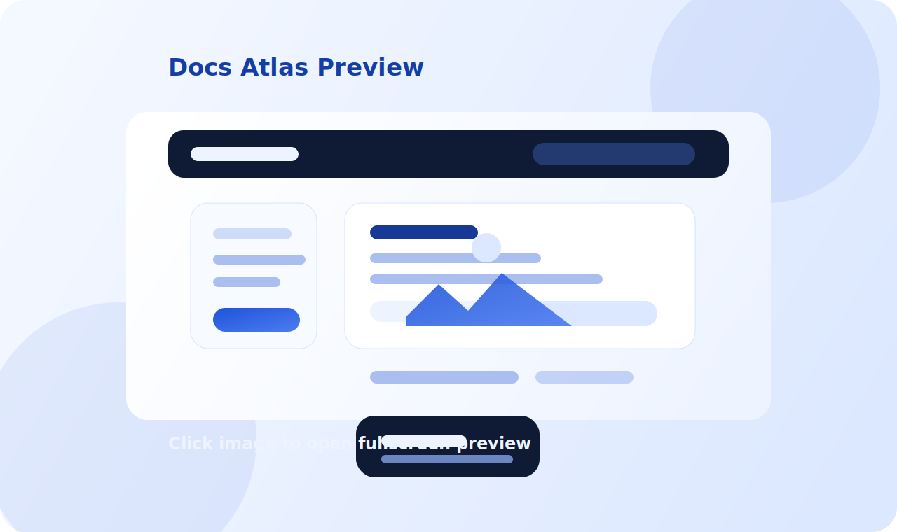

# 相对图片与预览

如果你的文档来自别的项目目录，图片也可以继续跟着 Markdown 一起维护，不需要手动复制到前端工程里。

## 推荐写法

把图片放在当前文档附近，然后在 Markdown 里用相对路径引用：

```md

```

## 示例图片

下面这张图片就是通过相对路径加载的。点击图片可以打开大图预览。

预览层支持：

- 放大、缩小、重置缩放
- 鼠标滚轮缩放
- 放大后可鼠标拖动平移图片
- 同一篇文档内多张图片左右切换
- 键盘 `←` / `→` 切换，`Esc` 关闭


## 推荐目录结构

```text
getting-started/
├── README.md
├── 04-images-and-preview.md
└── assets/
    └── docs-atlas-image-preview.svg
```

## 规则说明

- 图片路径相对于当前 Markdown 文件解析
- 图片需要位于对应文档源目录内部
- 开发环境可以直接访问
- 打包时会自动复制到站点静态资源目录
- 打包后的资源路径会带上 `source name`，避免不同文档源之间重名冲突

## 适合什么内容

- 架构图
- 流程图
- 页面截图
- 原型图
- AI 生成的设计图或说明图
